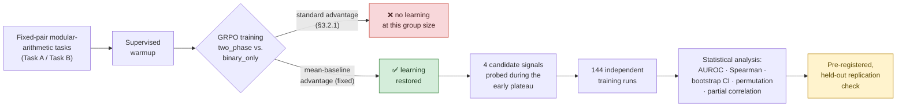
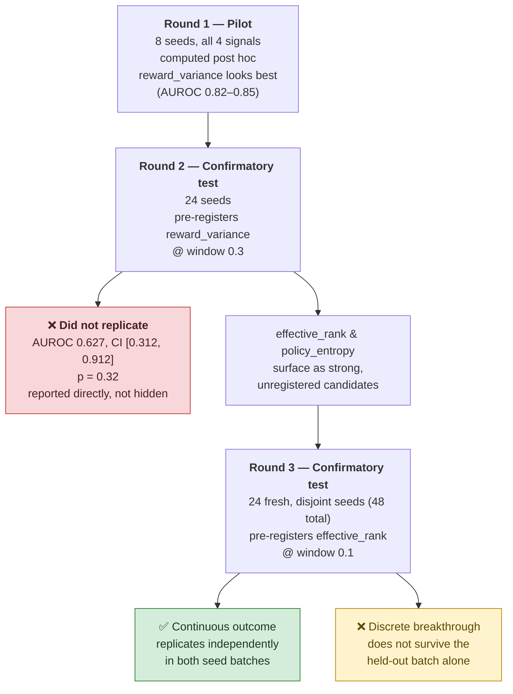

<div align="center">

<h1>🏔️ The Plateau Knows</h1>
<h3>Pre-Registered Evidence for Early Predictors of RL Training Outcomes</h3>

<p><em>Anonymous authors · submitted for double-blind review</em></p>

<p>
<a href="paper/main.pdf"></a>
<a href="LICENSE"></a>
<a href="requirements.txt"></a>
<a href="notebooks/the_plateau_knows.ipynb"></a>
<a href="results/summaries/validation_checks.json"></a>
<a href="#"></a>
<a href="#"></a>
</p>

</div>

<br>

> **TL;DR.** Grokking precursor signals from *supervised* learning were never tested under
> *reinforcement* learning. We built a compute-constrained testbed to test this, fixed a
> GRPO training-stability bug along the way, and ran a three-round **pre-registered** study.
> One signal we pre-registered simply **did not replicate** — we say so plainly. A second
> signal predicts a run's eventual training quality **robustly**, independently confirmed
> across two disjoint seed batches — but does **not** reliably predict the discrete
> breakthrough event that motivated the whole question. Both results, and everything in
> between, are in this repository exactly as produced.

<br>

## Table of Contents

- [Overview](#overview)
- [The Pipeline, End to End](#the-pipeline-end-to-end)
- [Key Results](#key-results)
- [The Central Finding, Visualized](#the-central-finding-visualized)
- [Three Rounds of Pre-Registration](#three-rounds-of-pre-registration)
- [Repository Structure](#repository-structure)
- [Reproducing the Results](#reproducing-the-results)
- [Method Summary](#method-summary)
- [Citation](#citation)
- [License](#license)
- [Reproducibility & Integrity Statement](#reproducibility--integrity-statement)

<br>

## Overview

Grokking — a long plateau at chance performance followed by an abrupt jump to high
accuracy — is well studied in supervised learning, where several signals are known to
precede the transition. A recent line of work shows an analogous plateau-then-breakthrough
pattern occurs during **reinforcement learning with verifiable rewards (RLVR)**, driven by
reward schedule rather than epoch count. This repository contains the complete,
reproducible pipeline behind a pre-registered, three-round study asking a question that, to
our knowledge, had not been directly tested:

<div align="center">

**Do the early-warning signals identified for supervised-learning grokking transfer to this qualitatively different RL setting?**

</div>

Along the way, we identified and fixed a training-stability failure mode in group relative
policy optimization (GRPO) that was silently preventing any breakthroughs from occurring at
our scale — a precondition for the scientific question to be askable at all.

**We report our findings honestly, including the ones that didn't confirm our hypotheses.**
A pre-registered signal from an early pilot (`reward_variance`) failed to replicate under a
properly powered follow-up, and we say so directly rather than substituting a
better-looking result. A second pre-registered signal (`effective_rank`) predicts a run's
eventual training reward robustly — independently replicated across two disjoint seed
batches, and surviving a check for whether it's just reflecting current reward level — but
its ability to predict the *discrete* breakthrough event that originally motivated the
question does **not** survive the same held-out replication test. We take that result at
face value rather than explain it away, and it is the paper's central finding.

<br>

## The Pipeline, End to End



*The GRPO fix (§3.2.1) is not a side note — it is the precondition for the entire study.
Under the standard per-group standard-deviation-normalized advantage, no run at our scale
ever broke through; a plain group-mean baseline restores learning, verified directly
against supervised training on an identical architecture and task.*

<br>

## Key Results

<table>
<tr><th align="left">Test (pre-registered primary: <code>effective_rank</code> @ window 0.1)</th><th>Statistic</th><th>95% CI</th><th><i>p</i></th></tr>
<tr><td>Discrimination (breakthrough vs. stall)</td><td>AUROC = 0.730</td><td>[0.508, 0.890]</td><td>0.0385</td></tr>
<tr><td>Continuous outcome (final reward)</td><td><i>r</i> = 0.647</td><td>[0.489, 0.756]</td><td>&lt; 0.001</td></tr>
<tr><td>Discrimination, controlling for raw reward</td><td>AUROC = 0.695</td><td>[0.506, 0.852]</td><td>0.0870</td></tr>
<tr><td>Continuous outcome, controlling for raw reward</td><td><i>r</i> = 0.630</td><td>[0.478, 0.751]</td><td>&lt; 0.001</td></tr>
</table>

<p align="center">
  
</p>
<p align="center"><sub><b>Figure.</b> Discrimination AUROC by candidate signal and early-window
fraction, all 96 Task A runs. <code>effective_rank</code> (pre-registered primary) and
<code>reward_variance</code> lead the candidate signals; note the <code>raw_reward</code>
baseline itself climbs to 0.87 by window 0.3 — precisely why the reward-controlled test
above matters.</sub></p>

<br>

## The Central Finding, Visualized

This is the table that drives the paper's honest framing — the held-out replication check
on a genuinely out-of-sample batch of seeds that were never used to select the signal:

<table>
<tr><th align="left">Seed batch</th><th><i>n</i> (breakthroughs)</th><th>AUROC (<i>p</i>)</th><th><i>r</i> (<i>p</i>)</th></tr>
<tr><td>0–23 <sub>(the batch that originally suggested this signal)</sub></td><td>48 (6)</td><td>0.790 (0.018)</td><td>0.615 (&lt; 0.001)</td></tr>
<tr><td><b>24–47 <sub>(the true, pre-registered confirmatory batch)</sub></b></td><td>48 (1)</td><td><b>0.277 (0.574)</b></td><td><b>0.663 (&lt; 0.001)</b></td></tr>
<tr><td>Both combined</td><td>96 (7)</td><td>0.730 (0.039)</td><td>0.647 (&lt; 0.001)</td></tr>
</table>

On the genuinely out-of-sample seed batch, discrete-breakthrough discrimination is *below
chance* and far from significant — the pooled significance in the row above is
substantially carried by the non-independent selection batch. The continuous-outcome
correlation, in contrast, replicates cleanly and independently in **both** batches. See
[`paper/main.tex`](paper/main.tex), §5.3, for the full discussion of why we treat this as
the paper's central finding rather than a nuisance to write around.

<p align="center">
  
</p>
<p align="center"><sub><b>Figure.</b> <code>effective_rank</code> at the early plateau against
eventual final reward, raw (left) and after residualizing out current reward (right),
colored by eventual breakthrough outcome. The relationship survives residualization
essentially unchanged — this signal is not simply reward in disguise.</sub></p>

<br>

## Three Rounds of Pre-Registration

We treat pre-registration as load-bearing, not a formality — the full history is released,
not only the final round that "worked":



<br>

## Repository Structure

```
.
├── paper/                        Full LaTeX source, bibliography, and figures
│   ├── main.tex
│   ├── references.bib
│   ├── iclr2027_conference.sty
│   └── figures/
├── src/                          Standalone, importable Python source for the entire pipeline
│   ├── tasks.py                  Fixed-pair modular-arithmetic task definitions (Task A / Task B)
│   ├── model.py                  TinyPolicy — the causal decoder-only transformer policy
│   ├── grpo.py                   GRPO trainer, incl. the mean-baseline advantage fix (§3.2.1)
│   ├── signals.py                The four candidate signal probes
│   └── analysis.py               Full statistical methodology (AUROC, Spearman, bootstrap,
│                                  permutation tests, partial correlation / residualization)
├── notebooks/
│   └── the_plateau_knows.ipynb   The complete, executed, end-to-end pipeline (74 cells, 0 errors)
├── results/
│   ├── figures/                  All 8 paper figures (vector PDF, publication-ready)
│   ├── tables/                   All 16 result tables (CSV + camera-ready LaTeX)
│   ├── metrics/                  Raw statistical outputs — every AUROC, correlation, CI, p-value,
│   │                             including secondary/exploratory tests that did not confirm
│   │                             the hypotheses under test
│   ├── configs/                  Exact configuration used to produce the reported results
│   ├── environment/               Full dependency/environment fingerprint
│   ├── summaries/                 Pipeline self-validation checks (15/15 passed)
│   └── raw_run_logs/               Per-step logs for all 144 independent training runs (archive)
├── docs/assets/figures/           PNG renders of key figures, for inline display in this README
├── requirements.txt
├── CITATION.cff
└── LICENSE
```

<br>

## Reproducing the Results

The entire pipeline — task definitions, model, training, statistical analysis, and every
figure and table in the paper — is a single, linearly-executable, fully resumable Jupyter
notebook: [`notebooks/the_plateau_knows.ipynb`](notebooks/the_plateau_knows.ipynb).

```bash
git clone <this-repository>
cd the-plateau-knows
pip install -r requirements.txt
jupyter notebook notebooks/the_plateau_knows.ipynb
```

Designed for a **single consumer/free-tier GPU** (developed and run end-to-end on a single
NVIDIA T4, ~4.4 hours wall-clock for the full 144-run pipeline). The notebook:

- **Auto-calibrates** its own step budget against measured per-step throughput and a
  configurable wall-clock ceiling, so it adapts to whatever GPU it's run on.
- Is **checkpoint-level resumable**: interrupting and re-running only retrains what's
  missing, validated against a training-relevant configuration hash so that extending the
  seed count (as done between Round 2 and Round 3) does not invalidate or retrain
  already-completed runs.
- Reproduces every number in the paper from **logged, machine-generated output** — nothing
  in `paper/main.tex` is manually transcribed, estimated, or rounded beyond the precision
  shown.

The `src/` modules mirror exactly what the notebook writes to disk at runtime and are
provided standalone for readers who want to import the trainer, the signal probes, or the
statistical analysis functions (`discrimination_auroc`, `continuous_outcome_correlation`,
`partial_discrimination_auroc`, `residualize`, …) independently of the notebook.

### Raw per-run logs

`results/raw_run_logs/all_144_runs_logs.tar.gz` contains the full per-step signal and
reward trajectory for every one of the 144 independent training runs behind this paper —
everything needed to recompute any statistic from scratch without retraining:

```bash
tar -xzf results/raw_run_logs/all_144_runs_logs.tar.gz -C results/raw_run_logs/
```

Trained model weights are not included in this repository (144 runs × ~3.3 MB), but are
fully reproducible by re-running the notebook, which will not retrain any run whose logs
are already present.

<br>

## Method Summary

<table>
<tr>
<td width="50%" valign="top">

**Tasks**
Two fixed-pair modular-arithmetic task families ($97 \times 97$ pairs, 50/50 train/test
split), deliberately matching the classic supervised-grokking setup — chosen after
diagnosing that an earlier, larger input space could not support the
memorize-then-generalize mechanism grokking depends on.

**The GRPO fix**
Standard GRPO's per-group standard-deviation-normalized advantage prevents *any* learning
at our group size and reward regime — verified directly against supervised learning on an
identical architecture and task. A plain group-mean baseline restores learning.

</td>
<td width="50%" valign="top">

**Four candidate signals**
Policy entropy, effective rank of hidden-state representations (Roy & Vetterli, 2007),
KL-divergence from a reference policy, and within-group reward variance — each measured
only during the early, near-chance plateau.

**Statistical methodology**
Discrimination AUROC with bootstrap CIs and permutation tests; a continuous-outcome
Spearman correlation using every run, not only threshold-crossers; partial correlation via
OLS residualization; Bonferroni-corrected secondary reporting.

</td>
</tr>
</table>

Full details, all four candidate signals' complete results, the seed-clustering finding,
the cross-task-family null result, and every stated limitation are in
[`paper/main.tex`](paper/main.tex).

<br>

## Citation

This work is under double-blind review. Please cite as:

```bibtex
@inproceedings{anonymous2027plateau,
  title     = {The Plateau Knows: Pre-Registered Evidence for Early Predictors of {RL} Training Outcomes},
  author    = {Anonymous},
  booktitle = {Under double-blind review},
  year      = {2027}
}
```

A machine-readable [`CITATION.cff`](CITATION.cff) is also provided.

<br>

## License

Code released under the [MIT License](LICENSE). See individual files for any third-party
attributions.

<br>

## Reproducibility & Integrity Statement

Every number in the paper traces to a specific logged cell output, checkpoint file, or
exported CSV/JSON artifact in this repository — none are estimated, interpolated, or
rounded beyond the precision shown. This includes every statistical test the pipeline ran,
not only the ones that confirmed the hypotheses under test: the Round 2 pre-registered
signal's failure to replicate, the held-out-batch result that narrows the paper's central
claim, the cross-task-family null result, and an attempted (incomplete) cross-architecture
check are all reported and included exactly as produced.

<div align="center">
<sub>Built for rigor, not for the cleanest-sounding story.</sub>
</div>
